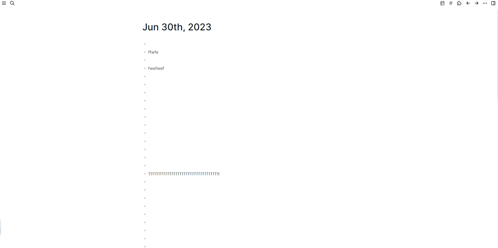

# logseq-save-scrollbar-position

A simple logseq extension that saves the position of the scrollbar on each page, and when you return to this page, it reverts to the position you last viewed.

It just saves the position of the scrollbar in the memory, so when you restart logseq desktop app, the last saved data will be cleared.

Double click on the toolbar dots button in the top right corner to bring the page back to the top.

Demo:

