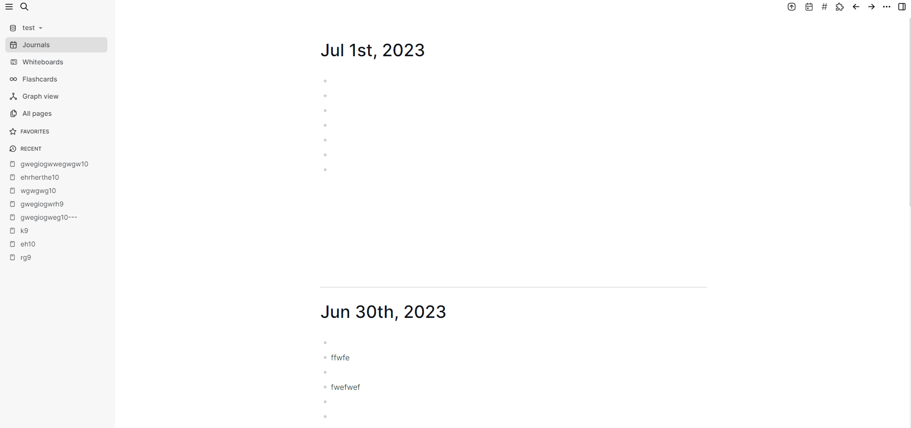
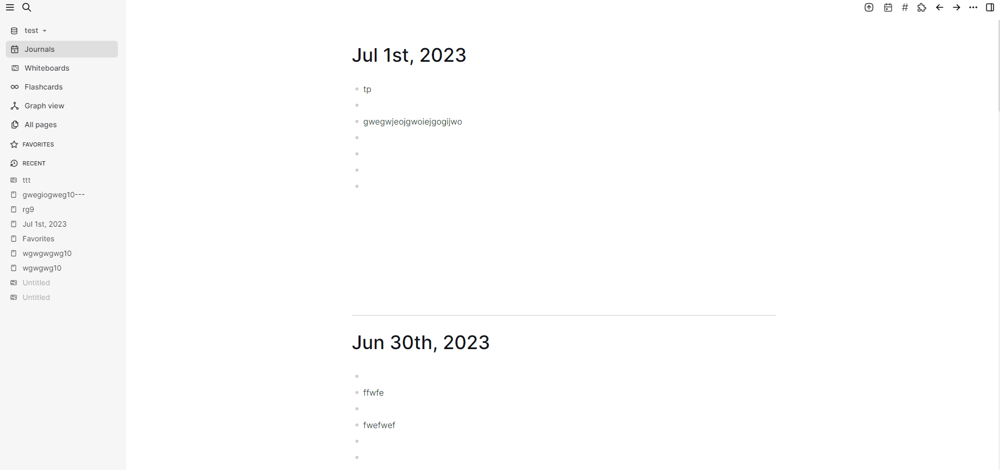
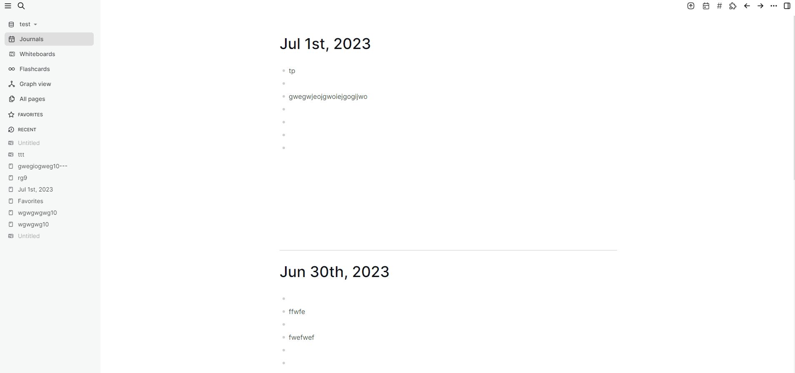

# logseq-save-scrollbar-position

A simple logseq extension that saves the position of the scrollbar on each page, and when you return to this page, it reverts to the position you last viewed.

It just saves the position of the scrollbar in the memory, so when you restart logseq desktop app, the last saved data will be cleared.

Because the content in a logseq page is loaded lazily, the new content is loaded when scrolling to the bottom of the page, so when returning to the previous page, the last saved position cannot be restored immediately, and the more content on the page the longer it takes.

Demo1, in the "Journals" page: 

Demo2, in the "Whiteboards" page:

Demo3, in the "All pages" page:

